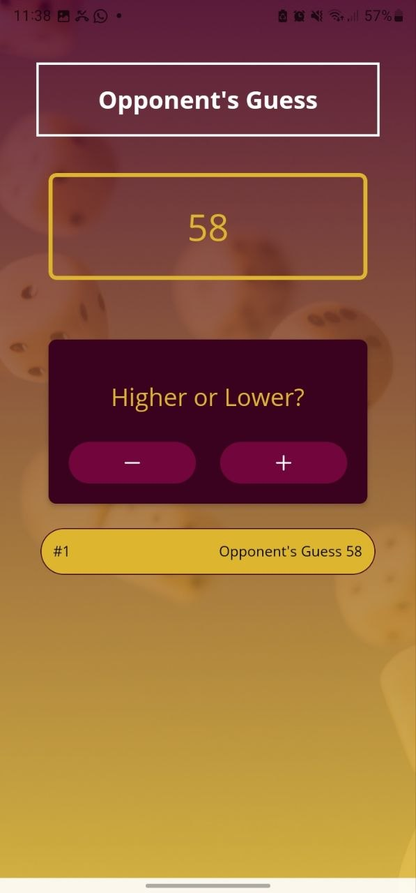
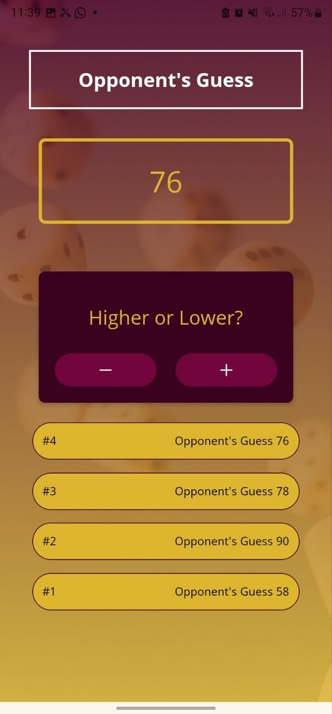
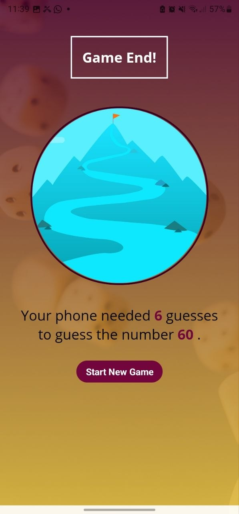

# Guess My Number 🎯

A sleek, responsive **React Native (Expo)** mobile game where the user inputs a secret number between **1 and 99**, and the computer tries to guess it. The game features interactive logic, validation, custom UI styling, responsive layouts for different screen dimensions, and a built-in "anti-cheat" system to ensure the user plays honestly!

---

## 📱 Screenshots Showcase

Below are screenshots from the game in action:

| 1️⃣ Start Game | 2️⃣ Game Guessing (Start) | 3️⃣ Game Guessing (Active) |
|:---:|:---:|:---:|
|  |  |  |

| 4️⃣ Cheat Detection | 5️⃣ Game Over & Stats |
|:---:|:---:|
|  |  |

---

## ✨ Features

- **Linear Gradient Background:** Beautiful gradient styling matching a custom visual palette.
- **Custom Fonts:** Uses the `OpenSans` font family (`OpenSans-Regular` and `OpenSans-Bold`) loaded dynamically via `expo-font`.
- **Keyboard Avoiding & Scrollable Views:** Seamless form-entry handling on all screen heights using `KeyboardAvoidingView` and `ScrollView`.
- **Dynamic & Responsive Layouts:** Dynamic margins and image sizes calculated programmatically via `useWindowDimensions` to look stunning in both landscape and portrait orientations.
- **Interactive Game Logs:** Keeps track of each guess in a scrollable, dynamically rendered history list.
- **Lying Detection System:** Prevents the user from providing false feedback to the AI opponent (e.g. telling the computer to guess higher when its guess was already larger than your number).
- **Restart functionality:** Easily reset the stats and start a brand-new game with the touch of a button.

---

## 🛠️ Tech Stack & Key Libraries

- **Framework:** React Native with Expo (v54.x)
- **Icons:** `@expo/vector-icons` (Ionicons)
- **Gradient Backgrounds:** `expo-linear-gradient`
- **Fonts:** `expo-font` & `expo-app-loading`
- **Safe Area Management:** `react-native-safe-area-context`

---

## 📁 Codebase Structure

```text
GuessMyNumberGame/
├── assets/
│   ├── fonts/           # Custom OpenSans TTF font files
│   └── images/          # Background and achievement images
├── components/
│   ├── game/
│   │   ├── GameLogItem.js      # Individual log row for guess history
│   │   └── NumberContanier.js  # Circular display for current guess
│   └── ui/
│       ├── Card.js             # Custom styled container component
│       ├── PrimaryButton.js    # Pressable button with custom feedback
│       ├── Title.js            # Styled text header for screens
│       └── instructionText.js  # Consistent sub-text format
├── constants/
│   └── Colors.js        # Global app theme color scheme
├── screens/
│   ├── StartGameScreen.js  # Initial setup screen (user inputs target number)
│   ├── GameScreen.js       # Play screen (computer guesses, user inputs higher/lower)
│   └── GameOverScreen.js   # Final screen displaying stats and restart button
├── App.js               # Application root and state machine manager
├── app.json             # Expo project configuration
└── package.json         # Dependencies and scripts
```

---

## 🚀 Getting Started

Follow these steps to run the game locally on your machine:

### 1. Prerequisites
Ensure you have **Node.js** installed on your system. You will also need the **Expo Go** app installed on your physical device (iOS/Android), or a running simulator/emulator.

### 2. Installation
Clone the repository and install the project dependencies:
```bash
# Install NPM packages
npm install
```

### 3. Running the App
Start the Expo development server:
```bash
# Start Expo development server
npm start
```
Or use the specific platform shortcuts:
```bash
# For Android
npm run android

# For iOS
npm run ios

# For Web
npm run web
```

Scan the QR code displayed in your terminal using the **Expo Go** app to test the game directly on your phone!

---

## 🎮 How to Play

1. **Enter a Target Number:** Type a number between `1` and `99` on the Start Game screen, and click **Confirm**.
2. **Provide Feedback:** The opponent (computer) will make a guess. 
   - Click the **Minus (-)** button if the computer's guess is **higher** than your secret number.
   - Click the **Plus (+)** button if the computer's guess is **lower** than your secret number.
3. **No Cheating:** If you click the wrong direction indicator (e.g. telling the computer to go lower when its guess is already below your target), the game will detect this and show an alert warning!
4. **Victory:** Once the computer successfully guesses your secret number, you'll see a game over screen with the total number of attempts it took to guess it correctly. Click **Start New Game** to play again.
